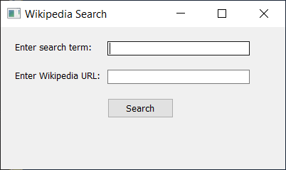

# Scrape Wikipedia in Python and Beautiful Soup and HTML5Lib
Scrape Wikipedia in Python and Beautiful Soup and HTML5Lib Project is a Python project that allows users to search for Wikipedia pages and retrieve the title and first paragraph of a page.

## Table of Contents
- [Installation](#Installation)
- [Usage](#Usage)
- [Features](#Features)
- [Authors](#Authors)
- [Acknowledgments](#Acknowledgments)
- [Example](#Example)

## Installation
To install Scrape Wikipedia in Python and Beautiful Soup and HTML5Lib Project, you can clone the GitHub repository:
> git clone https://github.com/Bogdan54/
Scrape-Wikipedia-in-Python-and-Beautiful-Soup-and-HTML5Lib.git

Then, navigate to the Scrape Wikipedia in Python and Beautiful Soup and HTML5Lib Project directory:

> cd Scrape-Wikipedia-in-Python-and-Beautiful-Soup-and-HTML5Lib 

Scrape Wikipedia in Python and Beautiful Soup and HTML5Lib Project requires the following dependencies:

* argparse
* requests
* BeautifulSoup
* html2text
You can install them using pip:

> pip install argparse requests beautifulsoup4 html2text PyQt5

## Usage
To use the graphical user interface, run the gui.py script:

> python gui.py
The GUI will open and allow you to search and parse Wikipedia pages.

You can also use the --url or --search command-line arguments to specify the page to search:

> python gui.py --url https://en.wikipedia.org/wiki/Python_(programming_language)

or

> python gui.py --search Python programming language
The output will be displayed in the GUI.

## Features
Scrape Wikipedia in Python and Beautiful Soup and HTML5Lib Project provides the following features:

* Ability to search for Wikipedia pages by title or URL
* Retrieval of the title and first paragraph of a Wikipedia page
* HTML syntax removal using html2text
* Contributing
* Contributions to Scrape Wikipedia in Python and Beautiful Soup and HTML5Lib Project are welcome! You can contribute by:

## Authors
Scrape Wikipedia in Python and Beautiful Soup and HTML5Lib Project was created by [Bogdan](https://github.com/bodab9) & [Bogdan](https://github.com/bogdan54).

## Acknowledgments
Thanks to the developers of argparse, requests, BeautifulSoup, and html2text for their contributions to this project.

## Example
Here is an example of how to use Scrape Wikipedia in Python and Beautiful Soup and HTML5Lib Project to search for the Wikipedia page for Python (programming language):

> python gui.py

The output will be in a form of a window where you can choose how you want to work with.

There you will input either a link or a search term and when you search it will open it in a notepad called output.txt.

## License
This project is licensed under the GPLv3 License.

## Reporting issues or bugs

Submitting feature requests
Forking the repository and submitting pull requests with your changes
